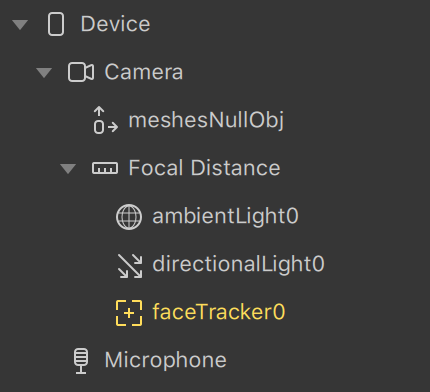
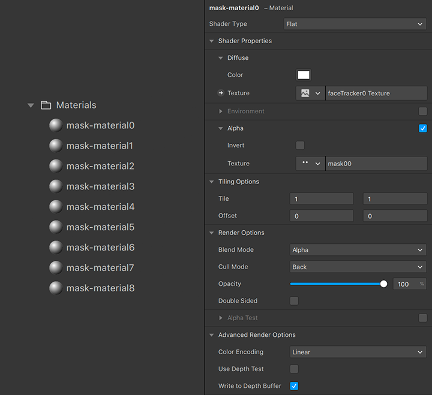
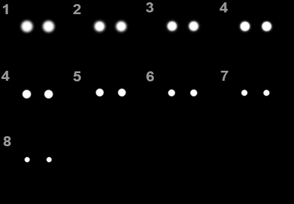
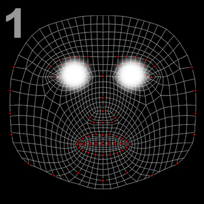
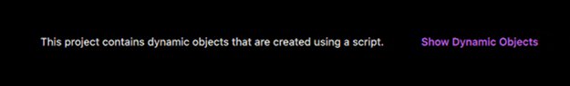

# Creating and Manipulating Objects with Scripts in Spark AR

This tutorial is part of the 2020 Facebook Developer Circles Community Challenge, if you wish to read the entry you may do so [here](https://devpost.com/software/manipulating-multiple-scene-objects-with-scripts-in-spark-ar), and you can also see the demo video [here](https://youtu.be/OEZxLtC7bXU)

## Overview 🔭
In this tutorial, you will create an AR effect that creates and manipulates multiple objects by taking advantage of the power of scripts in Spark AR Studio. The filter will produce a slinky-eye trail that is always catching up to the user's face. The key things you will explore are:
- Creating objects with scripts
- Using patterns to access multiple materials from our project
- Using iterators to manipulate several objects and materials
- The advantage of using scripts in certain situations

---

## Table of content 📋
- [Overview 🔭](#overview-)
- [Table of content 📋](#table-of-content-)
- [Prerequisites 🧑‍💻](#prerequisites-)
- [Getting started 🌱](#getting-started-)
- [Preparing the scene 🔧](#preparing-the-scene-)
    - [Scene hierarchy](#scene-hierarchy)
    - [Materials](#materials)
    - [Textures](#textures)
- [Scripting 🤖](#scripting-)
     - [Async/await](#asyncawait)
     - [Loading in the modules](#loading-in-the-modules)
     - [Creating Scene Objects](#creating-scene-objects)
     - [Adding materials](#adding-materials)
     - [Getting the face coordinates](#getting-the-face-coordinates)
     - [Animating multiple objects](#animating-multiple-objects)
- [The result ✨](#the-result-)
- [Next steps 🗺️](#next-steps-%EF%B8%8F)
- [Inspiration 💡](#inspiration-)
- [Related content 🏘️](#related-content-%EF%B8%8F)

---

## Prerequisites 🧑‍💻
- [Spark AR Studio version 102 or higher](https://sparkar.facebook.com/ar-studio/download/)
- A good understanding of [3D Objects in Spark AR Studio](https://sparkar.facebook.com/ar-studio/learn/articles/3D/3D-objects#adding-3d-objects-to-your-project)
- A basic understanding of the following concepts:
  - [Variables](https://developer.mozilla.org/en-US/docs/Web/JavaScript/Guide/Grammar_and_Types#Variables) \- [let](https://developer.mozilla.org/en-US/docs/Web/JavaScript/Reference/Statements/let) and [const](https://developer.mozilla.org/en-US/docs/Web/JavaScript/Reference/Statements/const)
  - [Arrays](https://developer.mozilla.org/en-US/docs/Web/JavaScript/Reference/Global_Objects/Array)
  - [Functions](https://developer.mozilla.org/en-US/docs/Web/JavaScript/Guide/Functions)
  - [Comments](https://developer.mozilla.org/en-US/docs/Web/JavaScript/Guide/Grammar_and_Types#Comments)

- An editor like [VS Code](https://code.visualstudio.com/), [Atom](https://atom.io/), or [Sublime Text](https://www.sublimetext.com/). VS Code is preferred, see why [here](https://sparkar.facebook.com/ar-studio/learn/scripting/scripting-basics/#code-autocomplete), but it isn't the only option

> If you don't have an understanding of some concepts mentioned above, you can do a light reading of the respective links.

# Getting started 🌱
The first part of any project is coming up with an idea and visualizing it, which will help us understand how to approach the problem. As I said, you will be creating a trailing effect around the eye area; to help you visualize this, you can find how the result will look below.


> You can also try out the final filter [here](https://www.instagram.com/ar/825126108015002/)

You may have been able to tell that a suitable approach to get this look - and the one you will learn in this tutorial - is to have multiple face meshes that are all catching up to the face at different speeds, and you would be correct.

To achieve the slow/catching up look, you will use both [Exponential Smoothing](https://en.wikipedia.org/wiki/Exponential_smoothing) and [Delay](https://en.wikipedia.org/wiki/Propagation_delay); if you are interested in knowing more about the concepts and math behind Exponential smoothing and delay you can follow the respective links.

The project shown above uses 36 meshes. As you can imagine, connecting and tweaking the parameters for all the meshes in the Patch Editor would be a slow and tedious process, as neither 'Dampening' (exponential smoothing patch) nor 'Duration' (delay patch) can take in a value in the Patch Editor. Moreover, you need to smooth each component of a vector (x,y,z) individually, bringing the total of parameters up to a ludicrous amount; that's were the scripts come in.

# Preparing the scene 🏗️

## Scene hierarchy


First of all, you will need to prepare your scene, as you can see, the scene is empty with the exception of a null object called "meshesNullObj", which is placed *outside* the focal distance, this is because you will move the objects in world-space coordinates.

You will create the face meshes dynamically, meaning you don't need to add them to the Scene hierarchy one by one inside the Studio

## Materials
The meshes should just show the eyes; you can achieve this by combining the faceTexture with an alpha mask.

You can get the face texture by going to the faceTracker and adding Texture extraction, and you can mask the eyes by using a simple eye-shaped image on the alpha slot of the materials.

You can use multiple masks with multiple materials to make the trail get thinner towards the end.

In this tutorial there will be nine materials, so that every four meshes in the trail, there is be a change in the material used by the mesh. You can add or remove materials depending on the look you want to achieve.



Each material will have the 'faceTracker Texture' assigned to its [Diffuse](https://sparkar.facebook.com/ar-studio/learn/articles/textures-and-materials/flat-material#adding-colors-and-textures) and one of the mask textures assigned to its [Alpha](https://sparkar.facebook.com/ar-studio/learn/articles/textures-and-materials/flat-material#properties), making the trail get a little bit smaller with every material change. You will also need to disable "Use depth test" to prevent unwanted artifacts as the masks move around and overlap, read more about using depth test [here](https://sparkar.facebook.com/ar-studio/learn/articles/textures-and-materials/standard-material/#standard-material-properties). The materials in this project are called mask-material\[00-08\].

## Textures
In the textures, you will need the faceTracker Texture extraction, which by default is called "faceTracker0 Texture", and the masks used to separate the eyes. The eight textures used for the masks in this project are named `mask\[00-08\]`.

To get the faceTracker Texture extraction texture, select you Face Tracker, and add "Texture Extraction".




In the images above, you can see how the masks get progressively smaller, as well as an overlay of the reference that Spark AR provides used to create the textures.

You can easily make the mask by using the [Face Assets Spark AR provides](https://sparkar.facebook.com/ar-studio/learn/articles/people-tracking/face-reference-assets/) and painting white the area around the eyes, as you can see in the second picture.

> You can get the same masks used in this project by following [this link](project/textures).

# Scripting 🤖
Now that the scene is done, you can start to build the script. The goal is to create all the masks you desire, and move in the fashion described [above](#getting-started).

To add a script, go to "Create Asset", select Script, and then open it in your editor of choice.

You are likely to see some default template with helpful links and instructions that Spark AR Studio provides every time you create a new script; you won't use any of the default code so you can delete it, but feel free to check out some of the links provided.

## Async/await
> If you already know what Javascript async/await is, you can skip this part and continue to the [next section](#loading-in-the-modules).

Asynchronous programming is the counterpart to the more well-known synchronous programming.

In asynchronous programming, the concept of Promises is introduced. A Promise is a proxy for a value not necessarily known when the promise is created; a Promise can be in one of three states:
1. Pending: It has neither been fulfilled nor rejected.
2. Fulfilled: The operation/s were completed successfully.
3. Rejected: The operation failed.

With `await` (inside an `async` function), you can define in which operations the execution should pause and wait for until the Promise is resolved.

Many functions in Spark AR Studio return a Promise, like `Scene.root.findFirst()` - used to access objects from the scene. For these cases, async/await provides an easy way of working with Promises.

Practical example:
```javascript
const Scene = require('Scene');
const FaceTracking = require('FaceTracking');
const Reactive = require('Reactive');

async function getCameraTextureMultiplyAndSet(){

    // Wait for findFirst to fetch the camera texture 👇
    const ct = await Textures.findFirst('cameraTexture0');

    // Wait for findFirst to fetch the material 👇
    const myMaterial = await Materials.findFirst('material0');

    // Multiply the RGBA signal of the camera texture by 1.2
    let brighter = Reactive.mul(ct.signal, 1.2);

    // Set the Diffuse of the material slot to our texture
    myMaterial.setTextureSlot('DIFFUSE', brighter);

};

// Execute the function to run it
getCameraTextureMultiplyAndSet();

/* Same function with closure (more advanced):
(async function(){
    const ct = await Textures.findFirst('cameraTexture0');
    const myMaterial = await Materials.findFirst('material0');
    let brighter = Reactive.mul(ct.signal, 1.2);
    myMaterial.setTextureSlot('DIFFUSE', brighter);
})();
*/
```

## Loading in the modules
You'll start by loading the different modules you need for this project; these are going to be your building blocks. You can check a full list of the modules available in Spark AR Studio [here](https://sparkar.facebook.com/ar-studio/learn/reference/scripting/summary#before-you-start).

```javascript
// 👇 This module is used to access, create, and manipulate the scene
const Scene = require('Scene');

// 👇 This module is used to access, create, and manipulate materials
const Materials = require('Materials');

// 👇 You'll use this module to get the face position data
const FaceTracking = require('FaceTracking');

// 👇 You can think of Reactive as Spark's special math module
const Reactive = require('Reactive');
```

You should assign each module to a [constant](https://developer.mozilla.org/en-US/docs/Web/JavaScript/Reference/Statements/const) so that you can use it later.

## Creating Scene Objects
Instead of creating multiple face meshes inside Spark AR Studio, you can create them directly in the script, this feature is called Dynamic Instantiation - [read more about it here](https://sparkar.facebook.com/ar-studio/learn/scripting/dynamic-instantiation#using-dynamic-mode). To do this, you have to use the `create` method from the [Scene module](https://sparkar.facebook.com/ar-studio/learn/reference/classes/scenemodule)

```javascript
// Scene.create returns a Promise
// So you have to use `await` and wait for the Promise to be resolved

// 'FaceMesh' is the name of the class Spark uses to describe and instanciate face mesh objects
let newMesh = await Scene.create('FaceMesh', {

  // You can set a unique name for the object as an initialState parameter
  name: 'awesome-mesh',

});
```

When you start adding dynamic objects to your scene, you will see a message like the one shown below; this is Spark's way of clearly letting us differentiate between objects created in the Studio, and ones instanciated with Scripts. This is just for development purposes, all objects dynamic or not will be shown in the final effect.



You will then need to asign this newly created object to a parent. To get the parent object of the meshes \(\'`meshesNullObj`\'\), you can use the `findFirst` from the Scene module.

```javascript
// Scene.findFirst returns a Promise
// So you have to use `await` and wait for the Promise to be resolved
// 'FaceMesh' is the name of the class Spark uses to describe and instanciate face mesh objects
let meshesParent = await Scene.root.findFirst('meshesNullObj');
```

And then to assign the mesh to the parent you must use the `addChild` function.

```javascript
// addChild returns a Promise too
// Which lets us wait for the operation before continuing
await meshesParent.addChild(newMesh);
```

All together, the code below will create and place a face mesh on your scene; this will allow you to change the amount of meshes on the scene astonishingly easily.

```javascript
// ... Modules truncated

// Create an async function, so you can use `await` inside it
async function createAMesh(){

  // Create a mesh
  let newMesh = await Scene.create('FaceMesh', {
    name: 'awesome-mesh',
  });

  // Find the parent object you desire
  let meshesParent = await Scene.root.findFirst('meshesNullObj');

  // Add the mesh as a child of the parent
  await meshesParent.addChild(newMesh);

};

// Execute the function to run the code
createAMesh();
```

You can then use a [for loop](https://developer.mozilla.org/en-US/docs/Web/JavaScript/Reference/Statements/for) to iterate the code as many times as you desire.

```javascript
// ... Modules truncated

// Create an async function, so you can use `await` inside it
async function createAMesh(){

  // You can set the amount desired as a variable
  // Which you can easy find and modify later on
  // E.g. add 36 meshes
  let amountOfMeshes = 36;

  let meshesParent = await Scene.root.findFirst('meshesNullObj');

  // The loop will execute the instructions inside as long as the condition is true
  // The loop condition will be based on the amountOfMeshes variable you declared above
  for (let index = 0; index < amountOfMeshes; index++) {

    let newMesh = await Scene.create('FaceMesh', {
      name: 'mesh' + index,
    };

    await meshesParent.addChild(newMesh);

  });

};

// Execute the function to run the code
createAMesh();
```

## Adding materials
Now, you should get all of the materials, so that you can assign them to the meshes. You could try to do something like this:

```javascript
await Materials.findFirst('mask-material00');
await Materials.findFirst('mask-material01');
await Materials.findFirst('mask-material02');
await Materials.findFirst('mask-material03');
// ...
await Materials.findFirst('mask-material08');
```

But as you may be able to tell, this isn't flexible, adding more materials would mean you'd have to modify the code too. Instead of using `findFirst`, you can use [`findUsingPattern`](https://sparkar.facebook.com/ar-studio/learn/reference/classes/materialsmodule#methods), which allows us to access multiple materials at once.

To do this, we specify a pattern for `findUsingPattern` to match against. This pattern can use the following control characters:

| Character | Meaning | Example |
| :-------: | :------ | :------ |
| * (asterisk) | It matches any characters sequence (including digits) | `material*'` will match any object named 'material' followed by some character(s) |
| \ (backslash) | It can be used to escape any of the control characters (including \'\\\' itself) | `'*\\*'` will match any material which contains a \'\\\' anywhere on its name |

```javascript
// This code will get any material with a name following the format:
// 'mask-material' + extra characters (includes numbers)

// findUsingPattern returns a Promise
// So you have to use `await` and wait for the Promise to be resolved
let materials = await Materials.findUsingPattern('mask-material*');
```

Because the array you get using `findUsingPattern` isn't in any specific order, you need to sort your array, the best way to do this is alphabetically (works with numbers too).

To do this, you can use the built-in javascript `Array.sort` and the `String.localCompare` functions. This code below will order your array in ascending order. Feel free to read more about [Array.sort](https://www.w3schools.com/jsref/jsref_sort.asp) and [localCompare](https://www.w3schools.com/jsref/jsref_localecompare.asp)

```javascript
// 👇 Get materials from the scene
let materials = await Materials.findUsingPattern('mask-material*');

// 👇 Sort them in ascending order
materials.sort((a, b) => {
  return a.name.localeCompare(b.name);
});
```

With this array of materials, you can evenly assign materials to all the meshes you create. Since you declared the amount of meshes as a variable, you can use it to assign the materials

```javascript
/*
Here, `index` is the index from the `for` loop.

👇 Get a number 0-1 indicating the place the object will occupy in the trail.

(index / amountOfMeshes)


Use the length property of the array to get the amount of materials.
The highest index of an array is always one higher than it's length,
so you need to subtract one.

(materials.length - 1)


You can now combine these two, to get the index of the material to use.
Math.round is used to make sure the index is a whole number.
*/

// This value will always be in the range [ 0 - materials.length ).
let materialIndex = Math.round(

  (index / amountOfMeshes) * (materials.length - 1)

  );
```

Now, you can add your materials to the objects you create, by selecting the respective material from your array.

```javascript
// ... Modules truncated
async function createAndAnimateMeshes() {
  // Settings you can easily change
  let amountOfMeshes = 36;
  // ----------------

  let meshesParent = await Scene.root.findFirst('meshesNullObj');

  let materials = await Materials.findUsingPattern('mask-material*');

  materials.sort((a, b) => {
    return a.name.localeCompare(b.name);
  });

  let transform = FaceTracking.face(0).cameraTransform;

  for (let index = 0; index < amountOfMeshes; index++) {
    let newMesh = await Scene.create('FaceMesh', {
      name: 'mesh' + index,
    });

    await meshesParent.addChild(newMesh);

    let materialIndex = Math.round(
      (index / amountOfMeshes) * (materials.length - 1)
    );

    newMesh.material = materials[materialIndex];
  }
}

createAndAnimateMeshes();
```

## Getting the face coordinates
You can use the [FaceTracking module](https://sparkar.facebook.com/ar-studio/learn/reference/classes/facetrackingmodule/) to get the position of the face in your script; this will allow us to do some math operations with the values and later use the results to animate the face meshes.

To get the data for the user's face, you need to use the [`face` method](https://sparkar.facebook.com/ar-studio/learn/reference/classes/facetrackingmodule.face), `face(0)` will give the values for the first face - which in the faceTracker "Tracked Face" dropdown is called "Face 1"; and then read the `cameraTransform` property to get the position of the face in the scene, this value is in *world-space coordinates*, so to get your objects to move correctly the null object to which you parent the meshes needs to be outside the Focal Distance - [read more about world and camera space](https://sparkar.facebook.com/ar-studio/learn/articles/world-effects/world-effects-introduction/).

Computers (and Javascript) [count from 0](https://www.howtogeek.com/149225/why-do-computers-count-from-zero/), so the 0th face is the first one

```javascript
// Store the reference to the face position data in a variable so you can use it later
let transform = FaceTracking.face(0).cameraTransform;
```

## Animating multiple objects
You already saw how to create objects. Since you are creating the objects dynamically, you can animate them as they get created. Adding your smoothing and delay settings at the top as variables (just like `amountOfMeshes`) will allow you to find and modify these parameters very easily.

```javascript
// ... Modules truncated
async function animateAndCreateMeshes(){
  let amountOfMeshes = 36;

  // Add extra settings as variables
  // Which you can easily find and modify later on
  let maxSmooth = 350;
  let maxDelay = 0.5;

  let meshesParent = await Scene.root.findFirst('meshesNullObj');

  let transform = FaceTracking.face(0).cameraTransform;

  for (let index = 0; index < amountOfMeshes; index++) {
    // ...
  });
};

animateAndCreateMeshes();
```

```javascript
/*
By dividing the maximum values you want by `amountOfMeshes` you get the "step" between objects
You can then multiply that value by the index to get which values that correspond to the specific index (object)

You should use 'index + 1' because otherwise the first mesh (the 0th index), would be placed on the exact face position (multiplying by 0), and the mesh wouldn't be seen because it would be perfectly aligned to the face
*/

let smoothBy = (maxSmooth / meshes.length) * (index + 1);
let delayBy = (maxDelay / meshes.length) * (index + 1);
```

Combining the loop with the code to create the specific settings for each iteration, you get the following:

```javascript
// ... Modules truncated

async function createAndAnimateMeshes() {
  // Settings you can quickly modify
  let amountOfMeshes = 36;
  let maxSmooth = 350;
  let maxDelay = 0.5;
  // ----------------

  let meshesParent = await Scene.root.findFirst('meshesNullObj');

  let materials = await Materials.findUsingPattern('mask-material*');

  materials.sort((a, b) => {
    return a.name.localeCompare(b.name);
  });

  let transform = FaceTracking.face(0).cameraTransform;

  for (let index = 0; index < amountOfMeshes; index++) {
    let newMesh = await Scene.create('FaceMesh', {
      name: 'mesh' + index,
    });

    await meshesParent.addChild(newMesh);

    let materialIndex = Math.round(
      (index / amountOfMeshes) * (materials.length - 1)
    );

    newMesh.material = materials[materialIndex];

    let smoothBy = (maxSmooth / amountOfMeshes) * (index + 1);
    let delayBy = (maxDelay / amountOfMeshes) * (index + 1);

    // Calculate the desired X value
    let xValue = Reactive.expSmooth(
      transform.x.delayBy({ milliseconds: delayBy }),
      smoothBy
    );

    // Calculate the desired Y value
    let yValue = Reactive.expSmooth(
      transform.y.delayBy({ milliseconds: delayBy }),
      smoothBy
    );

    // Calculate the desired Z value
    let zValue = Reactive.expSmooth(
      transform.z.delayBy({ milliseconds: delayBy * 10 }),
      smoothBy
    );
  };
};

createAndAnimateMeshes();
```

As you can see, changing the values for either smoothing or delay is remarkably easy, and if you prefer to have some axis affected in a more or less pronounced way relative to other axes, you can easily change tweak it to be that way, without having to change tens or even hundreds of Patches.

Now that you have a Scene Object and the new values you desire, now you just have to use them!

To do this, you just have to write the xValue, yValue and, zValue to the objects' [transform](https://sparkar.facebook.com/ar-studio/learn/reference/classes/scenemodule.sceneobjectbase).

```javascript
mesh.transform.x = xValue;
mesh.transform.y = yValue;
mesh.transform.z = zValue;

/*
You can apply the delaying/smoothing to the rotation if you want to,
why don't you try that as a challenge after you finish the tutorial?
*/
mesh.transform.rotationX = transform.rotationX;
mesh.transform.rotationY = transform.rotationY;
mesh.transform.rotationZ = transform.rotationZ;
```

## The result ✨
Here is the code as found in [the project](project). Take some time to read it and see if you can understand it; if you don't, you can use this map to find the different sections you may want to revise:

Set up:
- [Getting started 🌱](#getting-started-)
- [Preparing the scene 🔧](#preparing-the-scene-)
    - [Scene hierarchy](#scene-hierarchy)
    - [Materials](#materials)
    - [Textures](#textures)

Code:
- [Scripting 🤖](#scripting-)
     - [Async/await](#asyncawait) \- \[1\]
     - [Loading in the modules](#loading-in-the-modules) \- \[2\]
     - [Creating Scene Objects](#creating-scene-objects) \- \[3\]
     - [Adding materials](#adding-materials) \- \[4\]
     - [Getting the face coordinates](#getting-the-face-coordinates) \- \[5\]
     - [Animating multiple objects](#animating-multiple-objects) \- \[6\]


```javascript
// [2]
const Scene = require('Scene');
const FaceTracking = require('FaceTracking');
const Reactive = require('Reactive');
const Materials = require('Materials');

// [1]
async function createAndAnimateMeshes() {

  // Settings you can quickly and easily modfify (download the project and play around! 🙌✨)
  let amountOfMeshes = 36;
  let maxSmooth = 350;
  let maxDelay = 0.5;
  // ----------------

  // [3]
  let meshesParent = await Scene.root.findFirst('meshesNullObj');

  // [4]
  let materials = await Materials.findUsingPattern('mask-material*');

  materials.sort((a, b) => {
    return a.name.localeCompare(b.name);
  });

  // [5]
  let transform = FaceTracking.face(0).cameraTransform;

  // [3]
  for (let index = 0; index < amountOfMeshes; index++) {
    // [3]
    let newMesh = await Scene.create('FaceMesh', {
      name: 'mesh' + index,
    });

    await meshesParent.addChild(newMesh);
    // [4]
    let materialIndex = Math.round(
      (index / amountOfMeshes) * (materials.length - 1)
    );

    newMesh.material = materials[materialIndex];

    // [6]
    let smoothBy = (maxSmooth / amountOfMeshes) * (index + 1);
    let delayBy = (maxDelay / amountOfMeshes) * (index + 1);

    // [6]
    let xValue = Reactive.expSmooth(
      transform.x.delayBy({ milliseconds: delayBy }),
      smoothBy
    );
    let yValue = Reactive.expSmooth(
      transform.y.delayBy({ milliseconds: delayBy }),
      smoothBy
    );
    let zValue = Reactive.expSmooth(
      transform.z.delayBy({ milliseconds: delayBy * 10 }),
      smoothBy
    );
    // [6]
    newMesh.transform.x = xValue;
    newMesh.transform.y = yValue;
    newMesh.transform.z = zValue;

    newMesh.transform.rotationX = transform.rotationX;
    newMesh.transform.rotationY = transform.rotationY;
    newMesh.transform.rotationZ = transform.rotationZ;

  }

}

createAndAnimateMeshes();
```

> You can use this [link](project/package.arprojpkg) to see a packaged version of the project. Click "Download" to download it to your computer, and then open it in Spark AR Studio

# Next steps 🗺️
You saw how scripts can easily create and control multiple objects at once, and this makes the amount of parameters to tweak decrease dramatically, allowing you to explore more options and be more creative. I encourage you to come up with a project where you apply what you learned in this tutorial.

> Tip: The [Materials](https://sparkar.facebook.com/ar-studio/learn/reference/classes/materialsmodule), [Textures](https://sparkar.facebook.com/ar-studio/learn/reference/classes/texturesmodule) and [Scene](https://sparkar.facebook.com/ar-studio/learn/reference/classes/scenemodule) modules all contain `findByPath` or `findUsingPattern` methods. The [Materials](https://sparkar.facebook.com/ar-studio/learn/reference/classes/materialsmodule) and [Blocks](https://sparkar.facebook.com/ar-studio/learn/reference/classes/blocksmodule) modules also supports dynamic instances. Possibilities are endless.

Don't ever hesitate to look at the [Spark AR Scripting Object Reference](https://sparkar.facebook.com/ar-studio/learn/reference/scripting/summary), as it contains descriptions and examples for all the modules available and their methods.

This project is Open Source, and so can be yours! You can publish your projects for free on GitHub and help the Spark AR Community grow; make sure to include a [contributing.md](contributing.md) and a [code-of-conduct](code-of-conduct.md), so people know how to contribute; this project has both, if you wish to contribute, please make sure to read them before contributing (follow the respective links). You may also include a [License](LICENSE), so people seeing your project clearly know what they *can* and *can't* do with the project, if you don't know which license is right for your project, you can go to [choosealicense.com](https://choosealicense.com).

If you want to know more about contributing to open source projects, check this free course: \"[How to Contribute to an Open Source Project on GitHub](https://egghead.io/courses/how-to-contribute-to-an-open-source-project-on-github)\" which covers all you need to know.

# Related content 🏘️
## Official Spark AR content
- [Spark AR Community Facebook Group](https://www.facebook.com/groups/SparkARcommunity)
- [Spark AR Scripting Object Reference](https://sparkar.facebook.com/ar-studio/learn/reference/scripting/summary)
- [Reactive Programming \(in Spark AR Studio\)](https://sparkar.facebook.com/ar-studio/learn/scripting/reactive-programming#watching-signals)

## Community supported Github repositories
- The Spark AR Community [awesome-spark-ar](https://github.com/Spark-AR-Community/awesome-spark-ars) list - [Script section](https://github.com/Spark-AR-Community/awesome-spark-ar#scripts)
- [SparkAR-Snippets](https://github.com/Spark-AR-Community/SparkAR-Snippets), a colection of code snippets from the Spark AR community

## Related community made tutorials
- \"[Spark AR Scripting - EP 5 - Promises // How to use the new asynchronous APIs in JavaScript (v85+)](https://www.youtube.com/watch?v=AQv9GR16xMw)\" by [Sohail Mehra](https://www.instagram.com/sohailmehra/)
- \"[Dynamic instance/spawn in Spark AR v102+ With Full Explanation for the Code||Spawn objects](https://www.youtube.com/watch?v=xzWR1O2nmbk)\" by [Rbkavin](https://www.instagram.com/rbkavin/)


> Dynamic Instaces is a brand new feature, the Spark AR community is full of open and talented creators, so more tutorials will be made about this topic, and as they are published they will get added here. You can also read [the official documentation for Dynamic Instances](https://sparkar.facebook.com/ar-studio/learn/scripting/dynamic-instantiation)

## Inspiration 💡

- [Creating a forest with dynamic instances in Spark AR](https://www.instagram.com/p/CH5bNYtDIe5) by [Rbkavin](https://www.instagram.com/rbkavin/)
